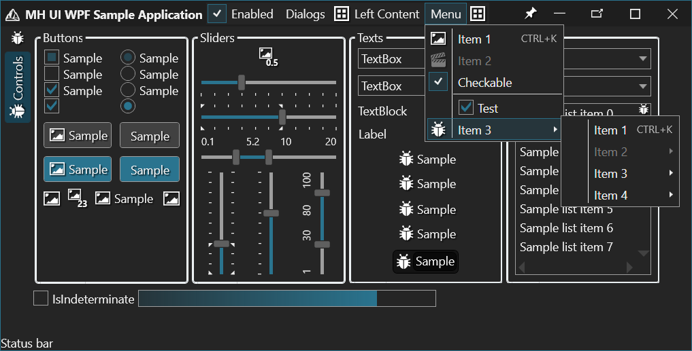

# MH.UI.WPF

**MH.UI.WPF** is a WPF-based library that extends the platform-independent `MH.UI` library by integrating it with WPF and providing additional utility classes, controls, converters, attached properties, and resources to simplify and enhance WPF development.

This library serves as a bridge between `MH.UI` and WPF, enabling easy integration and offering a suite of tools for developing rich, responsive WPF applications. It includes advanced UI components like custom sliders, virtualized panels, enhanced media players, and more, all specifically tailored for WPF.

## Features

- **Custom Controls**: A wide range of WPF controls, including advanced sliders, media players, tree views, and more.
- **Attached Properties**: Simplifies WPF development by providing reusable attached properties for common tasks like button styling, text manipulation, and more.
- **Converters**: Ready-to-use value converters for various common and advanced scenarios such as visibility, equality, property change detection, and data format conversion.
- **Behaviors**: Built-in behaviors such as focus management to improve user interactions.
- **Extensions**: Helper methods for WPF objects like `BitmapSource`, `DependencyObject`, and `FrameworkElement`, adding additional functionality to core WPF classes.
- **Dialogs**: Predefined dialog templates such as input dialogs, message dialogs, and progress dialogs to accelerate development.
- **DataTemplates & Styles**: Rich set of styles and DataTemplates for commonly used UI patterns like list items, log items, and named entities.
- **Resource Management**: Utility classes like `CachedResourceDictionary` to optimize resource loading and management.
- **Zoom and Pan**: Controls for zooming and panning, supporting smooth interaction with large content areas.